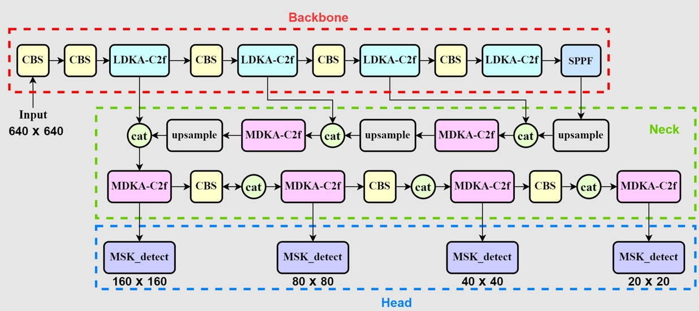

# DKA-YOLO

This repository is the implementation for DKA-YOLO object detection model

## Overview

- **YOLOv8 Backbone**: Utilizes the advanced YOLOv8 framework for base feature extraction.

- **LDKA-Conv**: Large-size Dilation Kernels Aggregation Convolution A module to extend the receptive field and enhance detailed feature extraction.

- **MDKA-Conv**: Multi-scale Dilation Kernels Aggregation Convolution： Enhances performance and efficiency through multi-scale feature extraction.

- **MSK-Detect Head**： Multi-Scale Kernel Detect: Improves feature diversity, generalization ability, and computational efficiency.

## Reference
- [github.com/ultralytics/ultralytics](https://github.com/ultralytics/ultralytics) 
- [github.com/AILab-CVC/UniRepLKNet](https://github.com/AILab-CVC/UniRepLKNet) 
